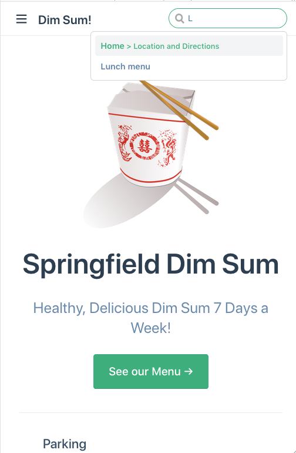

# Adding a title, hamburger menu, and search to your site

The simplest addition to [config.js](./config1.md) is the `title` attribute. 
This gives your site a whole list of features: search, a consistent title across
all the pages in your site, and a hamburger menu that automatically uses
the titles from your directory of markdown files to create a table of contents.

First, let's take a look at a simple site with no `config.js` at all:


The README.md for such a site would look like this:

###### file README.md
```yaml
---
home: true 
heroText: Springfield Dim Sum
heroImage: /img/springfield-dim-sum-800px.png
tagline: Healthy, Delicious Dim Sum 7 Days a Week!
actionText: See our Menu →
actionLink: ./menu.md
features:
- title: Parking
  details: Plenty of free parking at night and free validation during the busin
---
```

* Now create the file `/.vuepress/config.js` with the following contents:

###### file /.vuepress/config.js
```javascript
module.exports = {
    title: "Dim Sum!"
}
```

In a moment you'll see a change:


## What the title does

The title is added to all pages and, in the default theme, is added to the navbar.

See the VuePress [title](https://vuepress.vuejs.org/config/#title) documenation.

## Adding title adds search to every page

A new header appears on every page, consisting of a hamburger menu to the left, the title "Dim Sum!", and retractable 
search feature.

Explore these new features. For example, click the search icon and type something, 
for example, `L` for lunch.



For the purposes of this demo, we created these minimal files and placed
them in the project's root directory:

###### file lunch.md

```
# Lunch menu
```

###### file dinner.md

```
# Dinner menu
```

## Adding title automates navigation

* Choose the `Lunch menu` item to see that page:


Note how the VuePress default them has built links to the dinner menu and the home page.

* Choose the `Dinner menu` item.


Now you see links to the the home page and the lunch menu.

### Links are named after the first header in the markup file

You can see that VuePress automatically titled pages by reading the first header from each file. It orders
them alphabetically, by file name.


