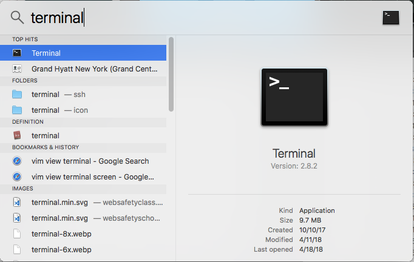
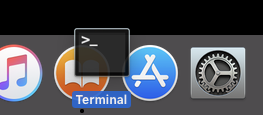
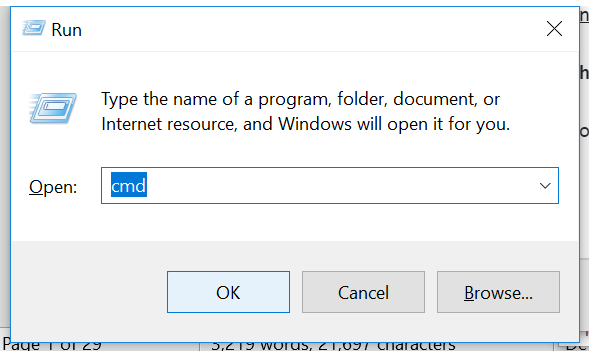
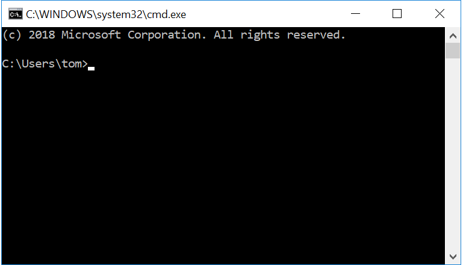
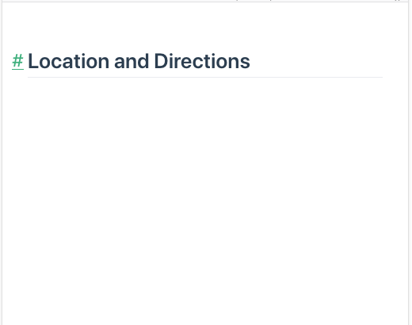

# Vuepress default theme tutorial: creating your home page

This is a step-by-step guide to creating a simple site
using the VuePress default theme. It's for an imaginary
restaurant named Springfield Dim Sum.

## Workflow

After you've installed [Node.js](https://nodejs.org) and [VuePress](https://vuepress.vuejs.org/guide/getting-started.html)
the typical workflow for creating a site is:

 Create a working directory and change to it
* Write markup files (text files with names ending in `.md` following a simple formatting convention
called [markdown](https://en.wikipedia.org/wiki/Markdown)), with the home page always named `README.md`,
and save them in the working directory
* Open a terminal window and run `vuepress dev` on the command line. This generates a website from
your VuePress source files, which include at a minimum `README.md`, and runs a webserver on your computer
* Open a browser window to [http://localhost:8080/](http://localhost:8080/) to see the live site
* Make changes to your markup files or create new ones. VuePress sees they've been created and 
automatically generates new output each time you save a file

## Opening a terminal

You'll need to drop into your operating system's command line to use VuePress. First open
a terminal.

### Opening a terminal on MacOS

The quickest way to find the terminal program on MacOS is this way:

* Choose the Spotlight icon, normally at the top of the screen
* Search for the word `terminal` and you'll see something like this in the results. Highlight the Terminal icon:



### Creating a Terminal shortcut on the MacOS dock (one time only)

You'll be using the Terminal a lot, so make a shortcut for it. You only need to
do this once.

* Under `Top Hits`, Drag the Terminal icon to the bottom of your screen, into the Dock.



Now you'll be able to start the terminal much faster next time.

### Opening the Windows command prompt

The quickest way to start the Windows command prompt is this:

* Press the Windows and R keys at the same time to bring up the Run dialog.



* Type `cmd` and press Enter.

The command prompt appears.



## Creating the directories for your VuePress site, MacOS version

Go to your normal work area, create the working directory, and move to it. 

In this case you would replace `~/code/` with wherever you choose to put your VuePress files. This site’s directory is creatively called `demo1`. It's also good to create subdirectories
for image and style sheet assets.

* Create the working directory and a subdirectory under it named `.vuepress` (don't forget that it starts with the period character). You can create them all at once like this:

```bash
# Create full directory path, including the
# necessary hidden directory .vuepress
$ mkdir -p ~/code/demo1/.vuepress
```

* And directories for assets such as images and style sheets. They can go anywhere; Vuepress imposes no convention for directories.

```bash
# Create directories for images and CSS.
$ mkdir -p ~/code/demo1/assets/img
$ mkdir -p ~/code/demo1/assets/css
```

::: tip
Always create the .vuepress sudirectory. It's not used at the moment but will be. All
VuePress sites other than the tiniest demos require it.
:::
* Now change to that directory. You will run `vuepress dev` or `vuepress build` from within it.

```bash
# Make it the working directory.
$ cd ~/code/demo1
```

## Creating the directories for your VuePress site, Windows version

Go to your normal work area, create the working directory, and move to it. 

In this case you would replace `%HOMEDIR%/code/` with wherever you choose to put your VuePress files. This site’s directory is creatively called `demo1`. It's also good to create subdirectories
for image and style sheet assets.

* Create the working directory and a subdirectory under it named `.vuepress` (don't forget that it starts with the period character). You can create them all at once like this:

```batch
:: Create full directory path, including the
:: necessary directory .vuepress
> md %HOMEDRIVE%%HOMEPATH%\code\demo1\.vuepress
```

* And directories for assets such as images and style sheets. They can go anywhere; Vuepress imposes no convention for directories.

```batch
:: Create directories for images and CSS.
> md %HOMEDRIVE%%HOMEPATH%\code\demo1\assets\img
> md %HOMEDRIVE%%HOMEPATH%\code\demo1\assets\css
```

::: tip
Always create the .vuepress sudirectory. It's not used at the moment but will be. All
VuePress sites other than the tiniest demos require it.
:::
* Now change to that directory. You will run `vuepress dev` or `vuepress build` from within it.

```batch
:: Make it the working directory.
> cd %HOMEDRIVE%%HOMEPATH%\code\demo1
```

## Creating a minimal home page

A VuePress site is a directory containing at least a file named README.md in Markdown form with at *least
one header.* Open your favorite text editor (not Apple Pages or Microsoft, because they add
formatting that won't convert properly) and create a file named `README.md` with the following contents:

```
## Location and Directions
```

<!-- tip TIP FOR DEFAULT THEME USERS -->

::: tip
If you're using the VuePress default theme to create your home page (and you are in this example), 
you should start
with a level 2 header (`##`, as shown above). That's because the level 1 header
is provided by the `heroText` YAML markup, to be explained later.
:::

## Running vuepress dev

`README.md` is all you need to create a minimal VuePress site. Let's take a look at your progress so far. Run `vuepress dev` on your command line:

```bash
$ vuepress dev
```

If all goes well you'll see output like this:

```
  VuePress dev server listening at http://localhost:8080/

  [13:55:39] ✔ successfully compiled.
```

Running `vuepress dev` creates a sort of temporary copy of the site on the fly. It converts the Markdown files (such as README.md) to HTML, so, for example, `## Location and directions` gets converted to HTML that looks like this:

```html
<h2 id="location-and-directions">Location and Directions</h2> 
```

It doesn't generate permanent HTML or Javascript files (that's why you'd run `vuepress build`) but it builds a live version of the site. You can make changes
to your Markdown files and the pages be updated dynamically the moment you save.

## Opening a browser window

Note the web address, which looks something like `http://localhost:8080/`. 

* Switch to a browser and browse to that address. 

Here's what you'll see:


## Taking a look at special VuePress default theme features

Although this is nominally a bare theme, you can already see it has a few advantages over a normal, blank HTML page. 
It has an attractive set of defaults for font, margins, and so on, and these will be uniform over all reasonably 
modern browsers. And there's something else that works great for technical documentation.

### Default theme feature: Markdown anchors

Move your mouse or touch over the headline and you'll see a pound sign appear.



That represents a link to this exact location on the page (called an anchor, corresponding to an
anchor tag in HTML). If you right-click it and choose to copy the link from the context menu, 
when you paste in that link it will be pasted as `http://localhost:8080/#location-and-directions`, not
just `http://localhost:8080`.

Any good website used for reference purposes should use descriptive anchors like this. Vuepress
generates them automatically. If you don't like this feature, it can be disabled. More on this later.


